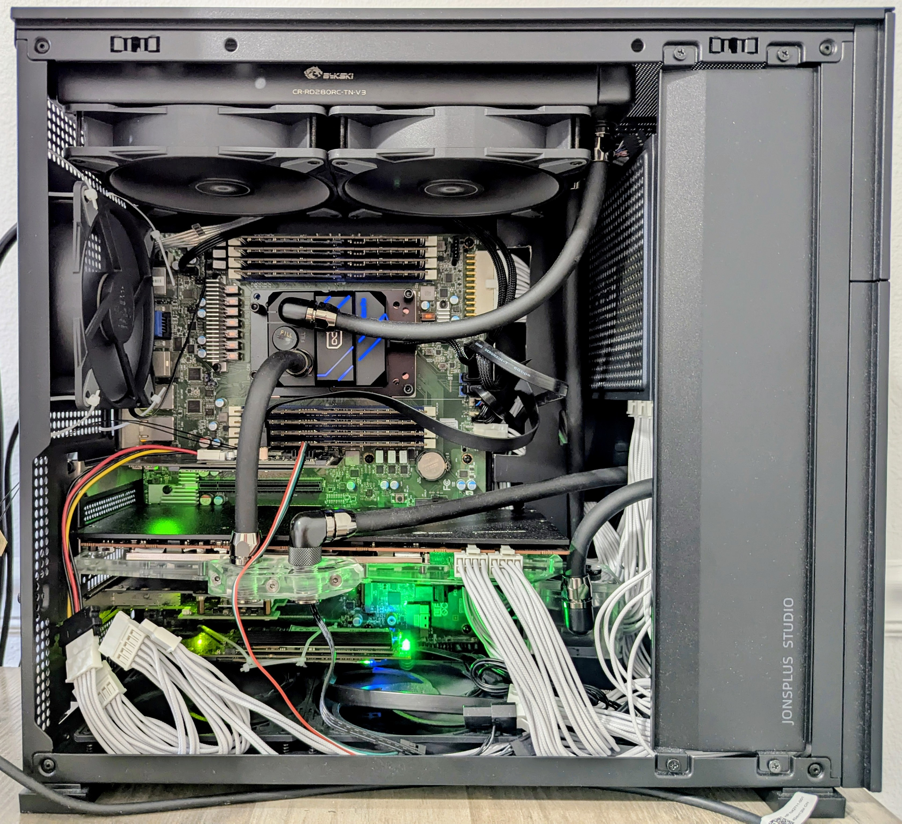

# Manual Deployment

I choose to deploy the software stack on-prem, because the hardware is more than adequate for the tasks, and I have already spend money building the system.

## On-prem Hardware and Software Overview

The hostname is *backwater*.

The machine is called *deepslate*.

The internal is so crowded because it have to fit within carry-on size limit.

### Hardware

- CPU: EPYC 7K62
- Memory: 32G x8 3200 MT/s RECC
- Networking:
    - Intel X550 10G ethernet controller
    - Intel I210 1G ethernet controller
    - Mellanox Connect X-3 10G ethernet controller
    - Intel AX210 WiFi card
- GPU: AMD RX 7900 XT 20GB
- Storage: (openZFS)
    - rpool (mirrored)
        - Intel Optane Memory M10 16G x2
    - HA-low_IO (mirrored)
        - Intel Pro 5250s 128G x2
    - HA-high_IO (raid-z1)
        - Netlist D1552 1.92T x3
        - Gigabyte GP-AG42TB 2T
    - Things_I_do_not_care (strip)
        - Netlist D1552 3.2T

### Software

- Platform
    - Proxmox VE (8.4.12)
        - Debian 12
        - Kernel: 6.14.8-2-bpo12-pve
        - Qemu: 9.2.0
- Network management
    - Pfsense (2.8.0)
        - FreeBSD 15

### Fun stuffs

I have a dual socket Xeon E5 V3 server at home running Intel Engineering Sample CPUs, and never had any issues. No one thought about cooling Server CPUs with water block back then, and I could not buy compatible mounting brackets for those CPUs, so I zip-tied the water blocks to the socket, and it worked great.

## Software Stack

## Network Diagram

## Configuration Summary Table

## Demo Video

## Screenshots
