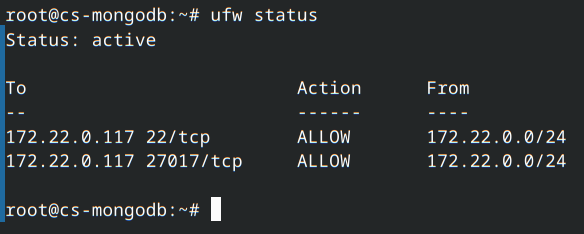

# Manual Deployment

I choose to deploy the software stack on-prem, because the hardware is more than adequate for the tasks, and I have already spend money building the system.

## On-prem Hardware and Software Overview

The hostname is *backwater*.

The machine is called *deepslate*.

[Deepslate](./assets/photos/deepslate.jpg)

The internal is so crowded because it have to fit within carry-on size limit.

<details>

### Hardware

- CPU: EPYC 7K62
- Memory: 32G x8 3200 MT/s RECC
- Networking:
    - Intel X550 10G ethernet controller
    - Intel I210 1G ethernet controller
    - Mellanox Connect X-3 10G ethernet controller
    - Intel AX210 WiFi card
- GPU: AMD RX 7900 XT 20GB
- Storage: (openZFS)
    - rpool (mirrored)
        - Intel Optane Memory M10 16G x2
    - HA-low_IO (mirrored)
        - Intel Pro 5250s 128G x2
    - HA-high_IO (raid-z1)
        - Netlist D1552 1.92T x3
        - Gigabyte GP-AG42TB 2T
    - Things_I_do_not_care (strip)
        - Netlist D1552 3.2T

### Software

- Platform
    - Proxmox VE (8.4.12)
        - Debian 12
        - Kernel: 6.14.8-2-bpo12-pve
        - Qemu: 9.2.0
- Network management
    - Pfsense (2.8.0)
        - FreeBSD 15

### Fun stuffs

I have a dual socket Xeon E5 V3 server at home running Engineering Sample CPUs, and never had any issues. No one thought about cooling server CPUs with water block back then, and I could not buy compatible mounting brackets for those CPUs, so I zip-tied the water blocks to the socket, and it worked great.
</details>

## Software Stack

### Message broker

Kafka with KRaft (not zookeeper)

The ration behind not using zookeeper is because zookeeper is deprecated and is now a legacy component.

I followed [Getting Stated on Kafka](https://kafka.apache.org/quickstart) to set up my kafka VM.

### Database

I choose MongoDB.

I followed the [Getting Started Guide](https://www.mongodb.com/docs/manual/tutorial/install-mongodb-on-ubuntu/) to install  the MongoDB with no alternation.

### Orchestrator

I choose K8s + Docker.

I followed [Getting Started Guide][https://docs.docker.com/engine/install/ubuntu/] for docker installation, and then I followed [Post install guide](https://docs.docker.com/engine/install/linux-postinstall/) to make sure non-root user can use Docker. In this case, user "kube".

Then, I followed [Getting Started Guide for K8s](https://kubernetes.io/docs/tasks/tools/install-kubectl-linux/#install-using-native-package-management) and [Getting Started Guide for MiniKube](https://minikube.sigs.k8s.io/docs/start/?arch=%2Flinux%2Fx86-64%2Fstable%2Fbinary+download) to set up the environment.

## Network Diagram

Here is how the network is structured.


For firewall on the VMs, I used UFW utility.

## Configuration Summary Table

### VMs

I set all the VM with the same configuration besides IP addresses

- CPU: 16 cores
    - Type: host
- Memory: 4 GiB
    - No ballooning
- Disk: 32 GiB
    - SCSI Single
- OS: Ubuntu 24.04 LTS
- Region: Nashville, on my desk.

### Creation steps


I added a http proxy for Ubuntu source utilizing my local apt-cacher-ng server located in DMZ, because using public repo too much may results in my IP being banned.

Inside `/etc/apt/apt.conf.d/00aptproxy`,

```conf
Acquire::http::Proxy "http://172.22.0.106:3142";
```

After setting up apt proxy, I did `apt update` and `apt upgrade` to make sure my system has the latest packages.

Overall, the installation almost use default values, and minimal changes are applied.

### Kafka

- Host: cs-kafka
- IP: 172.22.0.116/24
- Firewall:
    - 22/TCP
    - 9092/TCP


### MongoDB

- Host: cs-mongodb
- IP: 172.22.0.117/24
- Firewall:
    - 22/TCP
    - 27017/TCP



### k8s

- Host: cs-k8s
- IP: 172.22.0.118/24
- Firewall:
    - 22/TCP
    - 30000-32767/TCP


### SSH key only

I create a sudo non-root user on each of the machine, and changed the following config:

